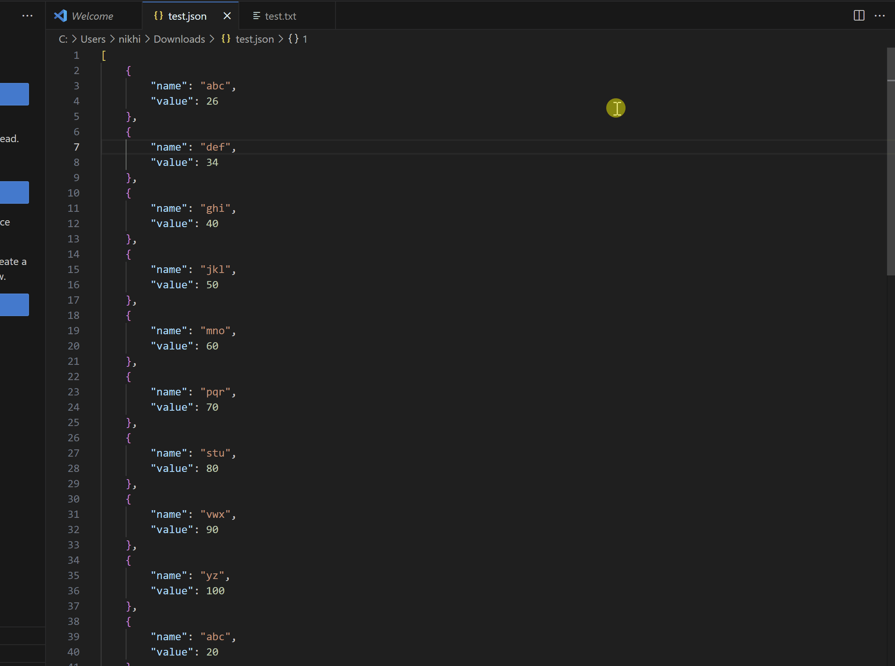

# jsonpatheditor README

Allows to use JsonPath queries on active json files in VsCode and displays results in a side window

## Features

- Keeps your json data local to your pc and is never uploaded or shared
- Real-time view of JsonPath evaluation results for the selected file
- Editing the json file automatically updates the results
- Uses JSONPath-Plus to support advanced JsonPath expressions https://github.com/JSONPath-Plus/JSONPath
- Extension auto detects a json file and shows an icon in the tool bar to open the extension

## Demo

## Release Notes

### 0.0.1

Initial release of JsonPathEditor

### 0.0.2

Handling enter key press

### 0.0.3
Added Copy to Clipboard feature
Theme changed to dark
UI elements rearranged

